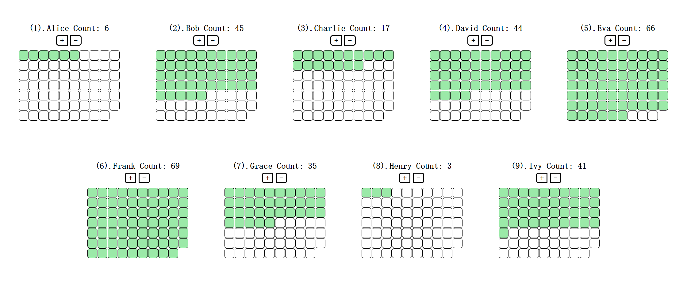

# vue-vote

可替代支部党建工作中用粉笔在黑板上写正字计票，部署简单快捷，但仅适用于人数较少的情况。

## 使用方法

鼠标或键盘均可进行计票：

1. 鼠标点击对应候选人下的 `+` 或 `-` 按钮，可实现当前候选人的票数增减，仅使用鼠标多次点击较为繁琐，因此也兼容键盘的计数功能；
2. 键盘预先为每位候选人绑定了 9 个数字键，因此当前版本不建议用于候选人较多的情况，按键绑定会较为麻烦。按 `<数字键>` 则对应数字的候选人票数 `+1` ，如有因误错漏票数，需要进行修正，按 `shift + <数字键>` 则对应数字的候选人票数 `-1` ；

## 个性化设置

作者很忙，还没有空写，详见代码捏 :smile: 

